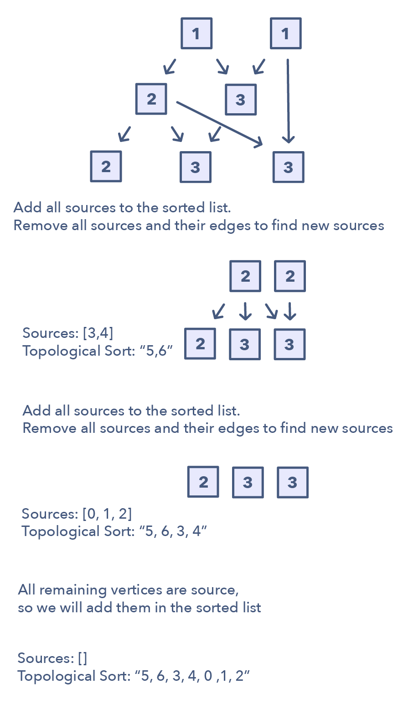

# 14. Topological sort

Topological Sort is used to find a linear ordering of elements that have dependencies on each other. For example, if event ‘B’ is dependent on event ‘A’, ‘A’ comes before ‘B’ in topological ordering.

This pattern defines an easy way to understand the technique for performing topological sorting of a set of elements.

The pattern works like this:
1. Initialization
    1. Store the graph in adjacency lists by using a HashMap
    2. To find all sources, use a HashMap to keep the count of in-degreesBuild the graph and find in-degrees of all vertices
2. Build the graph from the input and populate the in-degrees HashMap.
3. Find all sources
    1. All vertices with ‘0’ in-degrees will be sources and are stored in a Queue.
4. Sort
    1. For each source, do the following things:
        - i) Add it to the sorted list.
        - ii)Get all of its children from the graph.
        - iii)Decrement the in-degree of each child by 1.
        - iv)If a child’s in-degree becomes ‘0’, add it to the sources Queue.
    1. Repeat 4.1, until the source Queue is empty.

How to identify the Topological Sort pattern:
- The problem will deal with graphs that have no directed cycles
- If you’re asked to update all objects in a sorted order
- If you have a class of objects that follow a particular order

Problems featuring the Topological Sort pattern:
- Task scheduling (medium)
- Minimum height of a tree (hard)