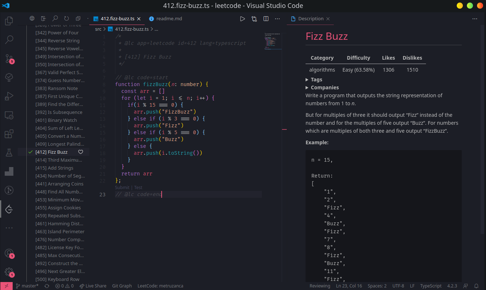
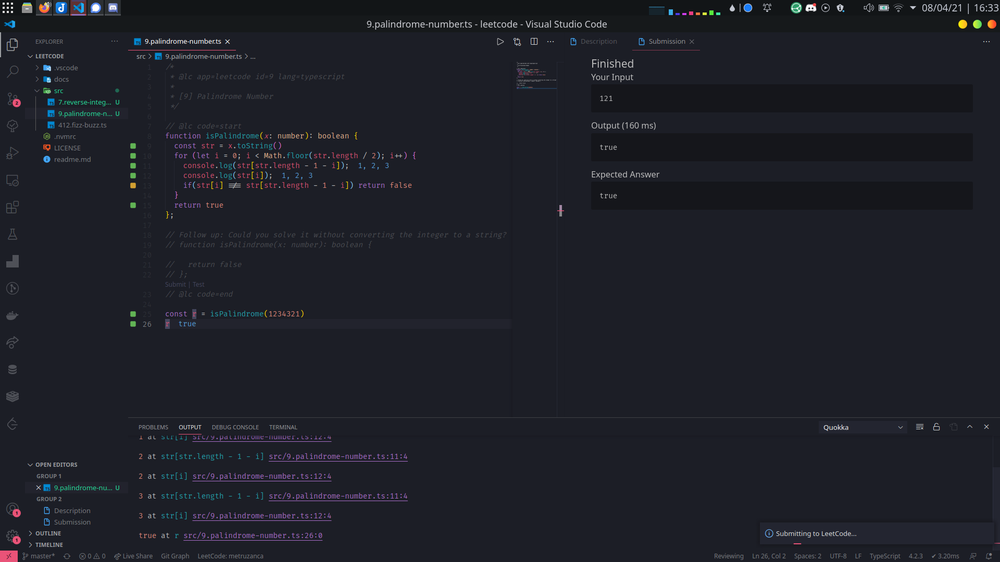
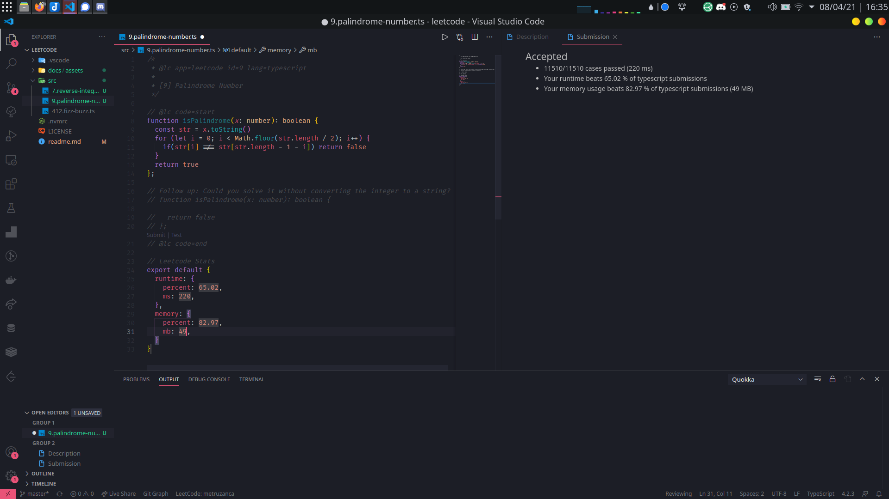

  

<h1 align="center">
  LeetCode
</h1>

This a repository for all my leetcode solutions.

_Why aren't I just using the web ui?_

1. Because muh editor.
2. Because GIT
    - Easy solution archiving thats not tied to leetcode
    - Leetcode deleted my old submissions.
3. Ability to, in the future, include this code into my website/blog via github API.
4. In the case of typescript/javascript quokkajs makes writing solutions much easier/faster
## Setup

1. [Install vscode extension for leetcode](https://marketplace.visualstudio.com/items?itemName=LeetCode.vscode-leetcode)

2. Login via third party e.g. github (leetcode changed their login process, so third party is a must)

3. Change Leetcode extension default workspace location to `<repository-root>/src`

Workflow examples:

## My Progress

[Go Here](src/readme.md)